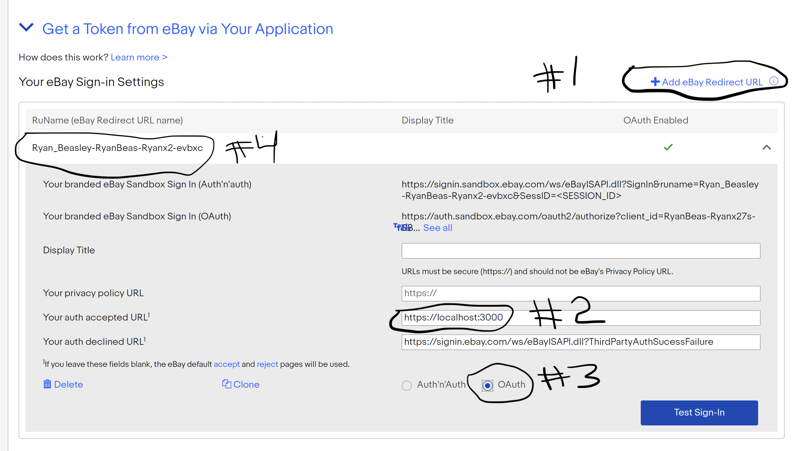

# Getting Started with Refresh Token

## Available Scripts

In the project directory, you can run:

### `npm start` or `npm run start:dev`

Runs the app in development mode against eBay sandbox environment.

### `npm run start:prod`

Runs the app in production mode against eBay production environment.

### `npm run build`

Builds the app for production to the `build` folder.\
It correctly bundles React in production mode and optimizes the build for the best performance.

The build is minified and the filenames include the hashes.\
Your app is ready to be deployed!

See the section about [deployment](https://facebook.github.io/create-react-app/docs/deployment) for more information.

## Required .env Files

In the root project directory (same folder as `package.json`), you'll need to add two `.env` files:

### `.env.development.local` (ebay: sandbox)


```
HTTPS=true
REACT_APP_AUTHORIZE_URL=https://auth.sandbox.ebay.com/oauth2/authorize
REACT_APP_CLIENT_ID=
REACT_APP_CLIENT_SECRET=
REACT_APP_REDIRECT_URI=
REACT_APP_SCOPES=https://api.ebay.com/oauth/api_scope/sell.inventory+https://api.ebay.com/oauth/api_scope/sell.fulfillment
REACT_APP_PROXY_URL=https://api.sandbox.ebay.com
```

### `.env.production.local` (eBay: production)

```
HTTPS=true
REACT_APP_AUTHORIZE_URL=https://auth.ebay.com/oauth2/authorize
REACT_APP_CLIENT_ID=
REACT_APP_CLIENT_SECRET=
REACT_APP_REDIRECT_URI=
REACT_APP_SCOPES=https://api.ebay.com/oauth/api_scope/sell.inventory+https://api.ebay.com/oauth/api_scope/sell.fulfillment
REACT_APP_PROXY_URL=https://api.ebay.com
```

The `.env` files tell the code how to interact with eBay. For both `.env` files, please fill in following fields using the [eBay access keys](https://developer.ebay.com/my/keys) page:

- REACT_APP_CLIENT_ID
- REACT_APP_CLIENT_SECRET
- REACT_APP_REDIRECT_URI (see [Configuring Redirect URI](#configuring_redirect_uri) below)

<a name="configuring_redirect_uri"></a>
## Configuring Redirect URI

This application requires a redirect URI be set in order to tell eBay where to redirect during authorization.  To configure, go to [eBay user tokens](https://developer.ebay.com/my/auth?env=sandbox&index=0) page and do the following:



1. Click `Add eBay Redirect URL` button
2. Fill in `Your auth accepted URL` with `https://localhost:3000`
3. Click `OAuth` option at the bottom
4. Copy `RuName (eBay Redirect URL name)` to applicative `.env` files under the variable `REACT_APP_REDIRECT_URI`

This process will need to be completed for both `sandbox` and `production`.

## Miscellaneous

Please contact [@ryanbeaz](https://github.com/ryanbeaz) if you have any questions or run into issues.